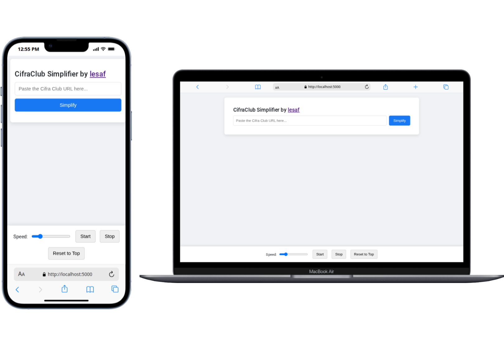

# CifraClub Simplifier

A simple and clean web application to simplify CifraClub guitar tabs, focusing on lyrics and chords for a distraction-free practice session.



---

## What is this for?

Playing an instrument often requires focusing just on the chords and the lyrics. Official tabs on websites like CifraClub are fantastic, but they often include complex solos, intros, and riffs formatted as tablature (tabs), which can be distracting during a casual playthrough or practice session.

This application solves that problem. You simply paste the URL of a Cifra Club guitar tab, and it intelligently scrapes the page, removes all the unnecessary tablature sections, and presents a clean, readable version with just the chords above the lyrics.

It also includes an autoscroll feature with adjustable speed, allowing for hands-free practice.

## Features

-   **Tab Simplification:** Automatically removes solo, intro, and riff tablature, leaving only the essential chords and lyrics.
-   **Clean UI:** Presents the simplified tab in a readable, well-formatted layout.
-   **Autoscroll:** Practice hands-free with an automatic scrolling feature.
-   **Adjustable Speed:** Easily control the scrolling speed with a simple slider to match your playing tempo.
-   **Responsive Design:** Looks and works great on both desktop and mobile browsers.

## How to Use

1.  Navigate to the live application.
2.  Find a guitar tab you like on `cifraclub.com.br`.
3.  Copy the full URL from your browser's address bar.
4.  Paste the URL into the search bar on the CifraClub Simplifier.
5.  Click the "Simplify" button.
6.  Use the controls at the bottom to start, stop, or adjust the speed of the autoscroll.

## Tech Stack

-   **Backend:** Python with the [Flask](https://flask.palletsprojects.com/) framework.
-   **Web Scraping:** [Beautiful Soup](https://www.crummy.com/software/BeautifulSoup/) and [Requests](https://requests.readthedocs.io/en/latest/).
-   **Frontend:** HTML5, CSS3, and vanilla JavaScript.
-   **Deployment:** Designed for cloud platforms like [Render](https://render.com/).

## Running This Project Locally

Interested in running this on your own machine? Follow these steps:

1.  **Clone the repository:**
    ```
    git clone https://github.com/lesaf92/cc_for_dummies.git
    cd cc_for_dummies
    ```

2.  **Create a virtual environment (recommended):**
    ```
    # For Windows
    python -m venv venv
    .\venv\Scripts\activate

    # For macOS/Linux
    python3 -m venv venv
    source venv/bin/activate
    ```

3.  **Install the required packages:**
    ```
    pip install -r requirements.txt
    ```

4.  **Run the Flask application:**
    ```
    python app.py
    ```

5.  Open your web browser and navigate to `http://127.0.0.1:5000`.

## License

This project is open-source and available under the [MIT License](LICENSE).
